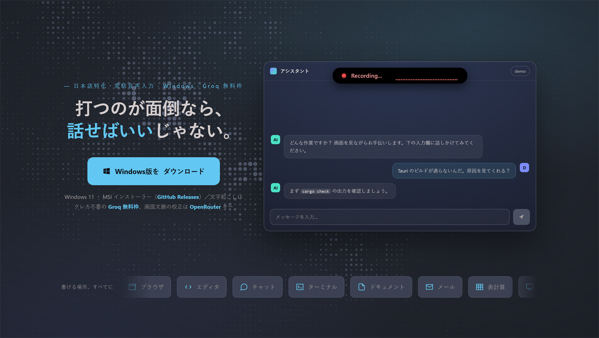

# Whispin

日本語特化の常駐音声入力ツール。Tauri 2 + Groq 無料枠で動作。



> 🌐 **プロモページ（ペライチ）:** [`docs/index.html`](docs/index.html) — GitHub Pages で公開する用のランディングページ。
> リポジトリの **Settings → Pages → Source: `main` ブランチ / `/docs` フォルダ** を選ぶと `https://kmiki0.github.io/whispin/` で公開されます。

## 動作概要

1. **右クリック長押し**（既定。設定でキー／マウスボタン・長押し時間を変更可）で録音開始
2. ボタンを離すと録音停止 → Whisper Large v3 Turbo で文字起こし
3. 画面の文脈（OCR）と固有名詞辞書をもとに LLM が誤認識を校正（任意・オフ可）
4. クリップボードに書き込み、元のフォーカスウィンドウに復帰して `Ctrl+V` を送出

## 必要環境

- Windows 11
- Node.js LTS
- Rust (rustup, stable-x86_64-pc-windows-msvc)
- Visual Studio 2022 Build Tools (C++ ワークロード + Windows 11 SDK)
- WebView2 ランタイム (Win11 はプリインストール済み)

## セットアップ

### 1. API キー

文字起こしと画面文脈の校正で別々のプロバイダを使います。キーは設定画面 (DPAPI で暗号化保存) か環境変数のどちらでも指定できます。

- **文字起こし (必須)**: Groq / OpenAI / OpenRouter のいずれか 1 つ。クレカ不要の **Groq 無料枠**が手軽 → `https://console.groq.com/keys`
- **画面文脈の AI 校正 (この機能を使うなら必須)**: **OpenRouter** キー → `https://openrouter.ai/keys` 。未設定なら文字起こし＋固有名詞辞書の置換のみ動作し、LLM 校正はスキップされます。

> ℹ️ ASR プロバイダは **OpenRouter → OpenAI → Groq** の優先順で、設定済みキーのうち最初に見つかったものを使います。Groq キーだけなら文字起こしは Groq 無料枠で動きます。

環境変数で渡す場合 (例 PowerShell ユーザー設定):
```powershell
[System.Environment]::SetEnvironmentVariable('GROQ_API_KEY', 'gsk_xxx...', 'User')
[System.Environment]::SetEnvironmentVariable('OPENROUTER_API_KEY', 'sk-or-xxx...', 'User')
```

新しいシェルを開いて反映を確認:
```powershell
$env:GROQ_API_KEY; $env:OPENROUTER_API_KEY
```

### 2. 依存インストール

```powershell
npm install
```

## 開発実行

このマシンでは VS BuildTools の `vcvars64.bat` が `INCLUDE`/`LIB` を設定しない (Windows SDK のレジストリ登録が欠けている) ため、ラッパースクリプトで env を補ってから dev サーバを起動する:

```powershell
pwsh scripts/dev.ps1
```

初回ビルドは 5〜10 分かかる。以降は差分のみ。

## プライバシーとセキュリティ

このツールは常駐し、画面・マイク・入力に触れます。何をどこへ送るかは以下の通りです。

- **常駐入力フック**: トリガー検出のため Windows の低レベルフック (`WH_KEYBOARD_LL` / `WH_MOUSE_LL`) を常駐させます。実際に反応するのは設定したトリガーのみですが、技術的には全キー入力を監視できる位置にあります。挙動はソースで検証できます。
- **画面文脈の送信**: AI校正が有効なとき、録音中にアクティブウィンドウをスクリーンキャプチャ + OCR し、その文字を校正用 LLM (OpenRouter) へ送信します。画面にパスワード等がある場合に備え、設定の **「画面文脈を使う」をオフにするとキャプチャ・送信を一切行いません**。
- **音声データ**: 文字起こしのため ASR プロバイダ (Groq / OpenAI / OpenRouter) へ送信します。ローカルには保存しません。
- **マイク常時オープン (warm mic)**: 押下から録音開始までの遅延と頭切れを防ぐため、起動直後にマイクを開いて待機し、録音終了後も次に備えて開いたままにします。このため **OS のマイク使用インジケータが常時点灯**します。録音していない間の音声は録音・処理・送信のいずれも行いません (`MediaRecorder` が回るのはトリガー中のみ)。
- **他アプリ音声の一時ミュート (ダッキング)**: 録音中、聞き取りを妨げないよう自分以外の音声セッションを一時的にミュートし、終了時に元へ戻します。音量操作のみで、他アプリの音声を読み取ったり送信したりはしません。
- **API キーの保管**: 設定画面で入力したキーは **Windows DPAPI で暗号化**して `settings.json` に保存します (平文では保存しません)。環境変数 `GROQ_API_KEY` 等でも指定できます。
- **クリップボード**: 貼り付けの一定時間後、転写テキストが残っていれば元の内容に戻します。

## 実装状況

- ✅ 録音 → Whisper 文字起こし → 自動貼り付け (画面上端のノッチ UI + 波形ビジュアライザ付き)
- ✅ 画面 OCR + 固有名詞辞書 + LLM 校正による文脈補正
- ✅ 設定 UI (トリガー / AI校正 / 辞書 / マイク / 自動起動)
- ✅ Toggle 録音・無音自動停止
- ✅ 録音中の他アプリ音声の自動ミュート / 復元 (ダッキング)
- ✅ アクティブウィンドウのフォーカス枠オーバーレイ (録音中・OCR スキャン演出付き)
- ✅ マイク事前ウォーム (warm mic) による押下→録音開始の遅延・頭切れ低減
- ✅ 音声反応の波形ビジュアライザ + ノッチ状態アニメ (録音 / 文字起こし / 完了など)
- 🚧 トリガー: 既定は右クリック長押し。`tauri-plugin-global-shortcut` が bare AltRight を Windows VK にマップしない問題のため、低レベルフック方式へ移行済み
